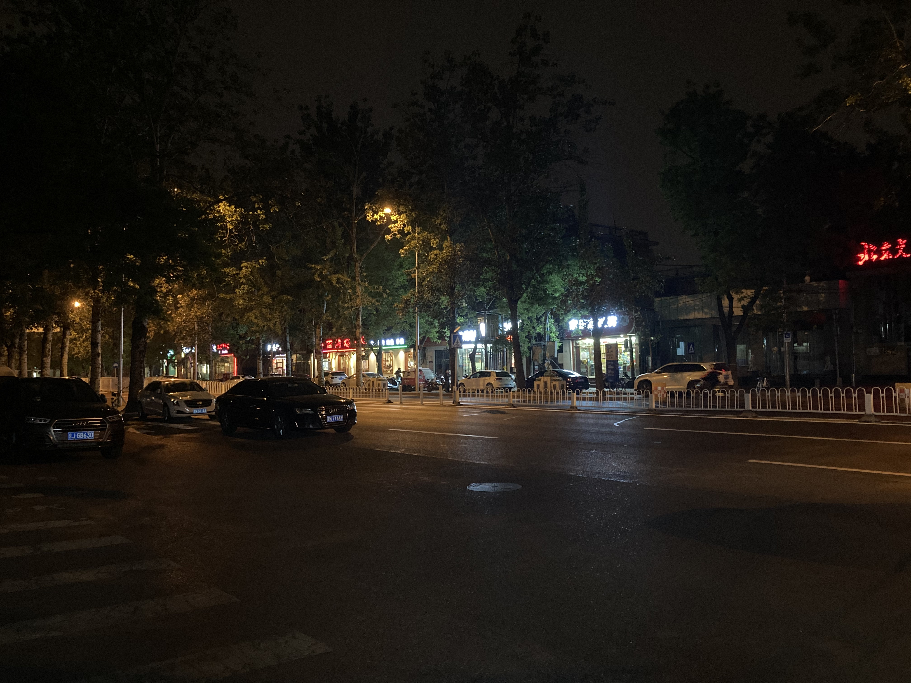

## 2020年05月06日

    

下班路上，拿着手机想着随便拍点什么东西吧，随手拍了一下街上对面的商铺。在眼睛里漆黑的小路上出现了一些不同颜色的光还是挺好看的，当然照片不好看。照片整体太黑了，看不出内容，而且内容没有中心。

    

这是在路口等红绿灯的一张照片，比上一张明亮一点，因为对面居民楼不同颜色的灯，整体色彩丰富一点。右上角的天桥挡住了一部分镜头，反而稍微有点被掩盖的未知的东西的感觉。不过照片放大后很明显看到道路很脏，很乱。

这两张照片都有太多杂质了，包括以前或以后的很多照片。毕竟我们生活的环境就是这样，难免会把“多余”的东西带进来。
