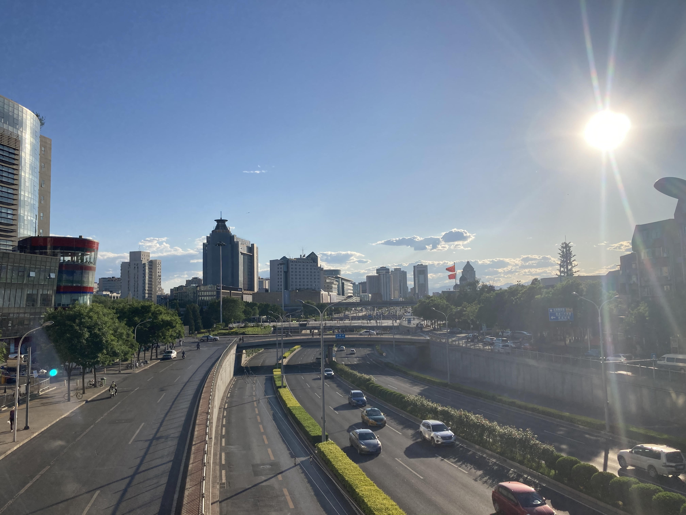
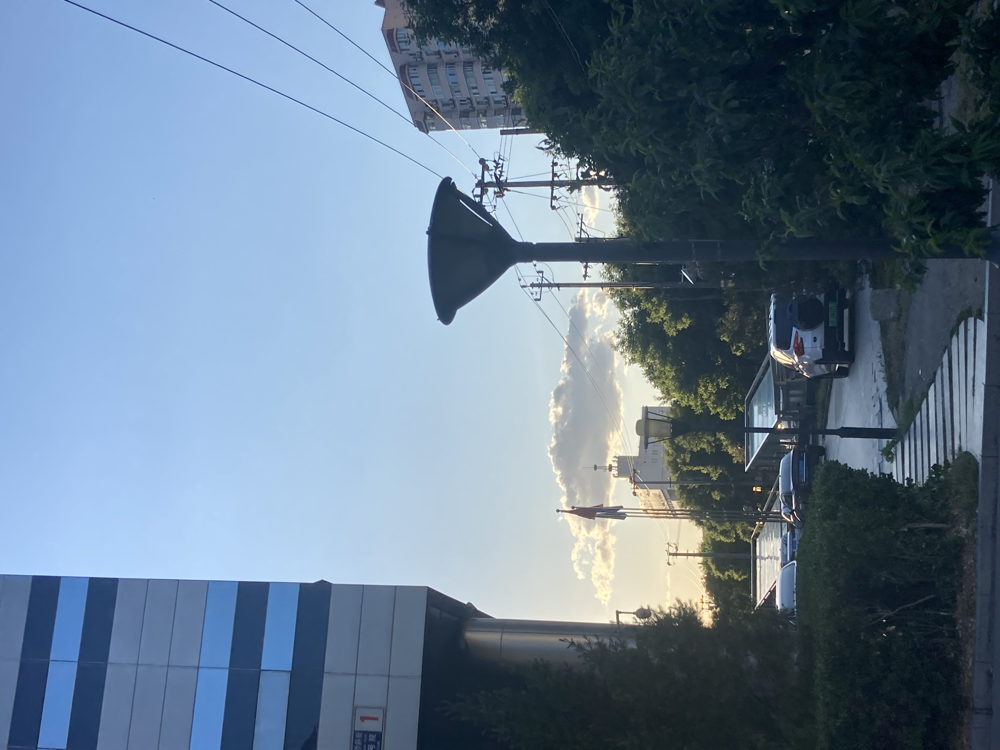

## 2020年05月23日

出门散步，就近溜达溜达。

    

阳光真好，天很蓝，云彩很好看。

    

这是一张失败的照片，可能是技巧的问题，也可能是设备的问题。很明显在逆光的情况下，太阳的光线会显得特别刺眼。这个场景是很好看的，太阳穿过柳树条，像某些场景的头发一样，有朦胧的感觉，我拍不出来。

    

拍完柳树，转身，顺手排一下吧。

    

和第二张柳树的图片是一样的情况，本来树梢上有暖色的阳光的光芒，拍到照片里就通通不见了。

    

身边也没别人，看这几个字正正好好，也顺手拍一下吧。
