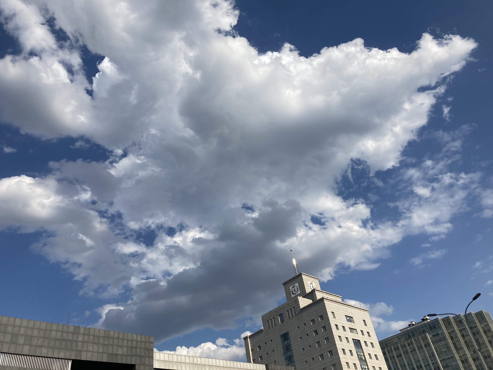

## 2020年05月24日

今夜阳光明媚，今夜多云转晴。

    

（1）

    

（2）

    

（3）

在路上走走停停，看看街道看看天空。偶然看见前后的一两个人，也是走走停停，最终止步在一处花草从前，拿出手机，有些犹豫。

能想象到那位年龄可能稍微大一点的阿姨，喜欢拍花拍草，看到路边的花，有些心动，但碍于在路上，有行人，碍于某种……面子或者不好意思的情绪，迟迟“不敢”认真的拍下眼前的画面。（内心戏：拍这种东西会不会显得没见过世面？拍这些东西会不会显得有点low？）

我有过多次这样的情绪，也正试着克服。

---

这是用 [fotor](https://www.fotor.com/) 一建美化后的图2，亮度增加了一些，感觉色彩更鲜艳了。

    

