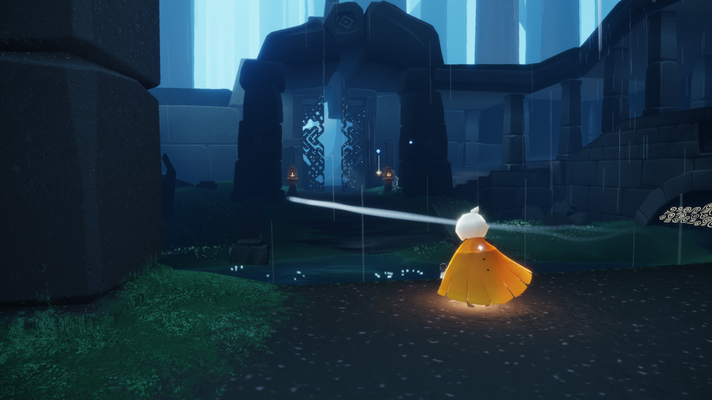
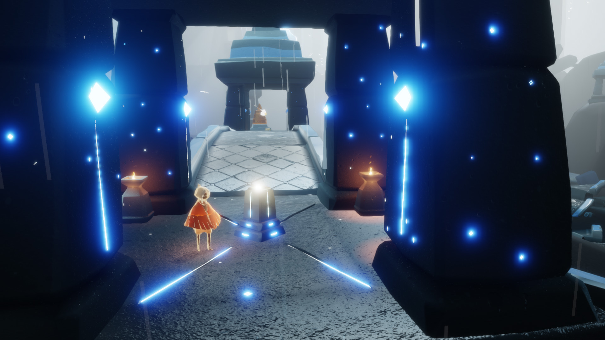
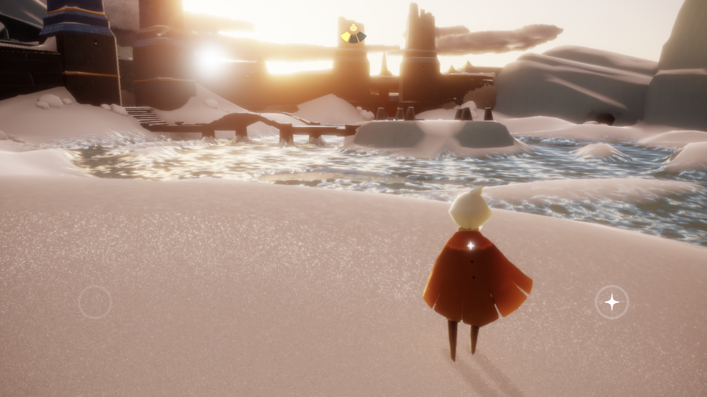
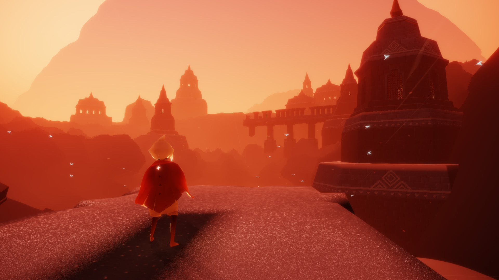
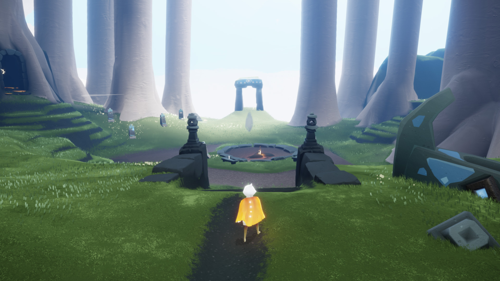

## 2020年06月14日

有一种新兴职业叫游戏摄影师。随着游戏画质越来越好，风景越来越漂亮，很多人开始专门在游戏里截图，作为新的摄影形式。

发现一款好玩的手机游戏，叫《光 · 遇》，画面优美优雅，自带背景音乐，可以在天空里飞翔，刚进入游戏的几个小时我沉迷于这款游戏了，这是几个游戏的截图。说真的，游戏体验比图片震撼多了。

 

    

（1）
 

    

（2）
 

    

（3）
 

    

（4）
 

    

（5）
 

不过后来我把游戏卸载了，玩过几个章节后，有一个不太好过的关卡，危险重重，而如果要是有伙伴陪同，难度就会下降很多。

有小伙伴我还玩游戏？搞不懂这游戏的逻辑。

因为无法继续后面的内容，前面的内容也没有太多新鲜感了，所以无法继续再玩下去。我只希望有一个风景优美的没什么难度的可以闲逛的让人放松的游戏，仅仅是消磨时间，不需要有难度有挑战，有世界观最好，场面宏大的内容丰富的……

